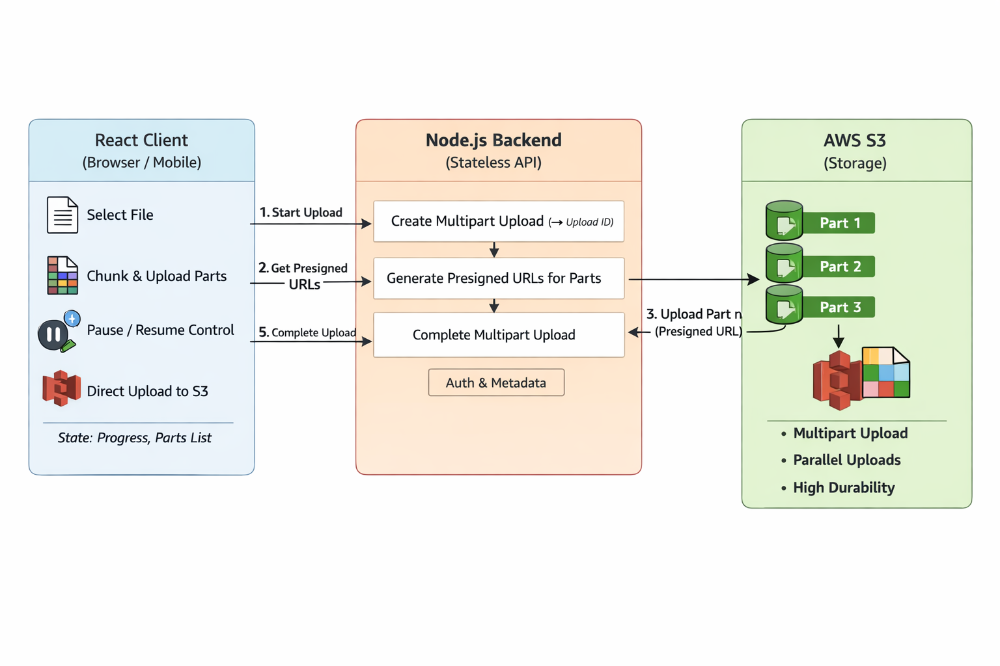

## S3 UPLOAD



- Core Goals

- Upload very large files (GBs)
- Stream data (no memory buffering)
- Pause / resume uploads
- Retry failed parts
- Minimal server load
- High throughput & cost-efficient

## ✅ Recommended Architecture (BEST PRACTICE)

- Your server does NOT handle file data

```
Client  ───►  S3
   │
   └──► Backend (only for auth + signed URLs)

```

## 1️⃣ Use S3 Multipart Upload

1. Why multipart?

- Uploads file in chunks
- Parallel uploads
- Resume from failed chunks
- Pause / resume support
- Faster + fault-tolerant